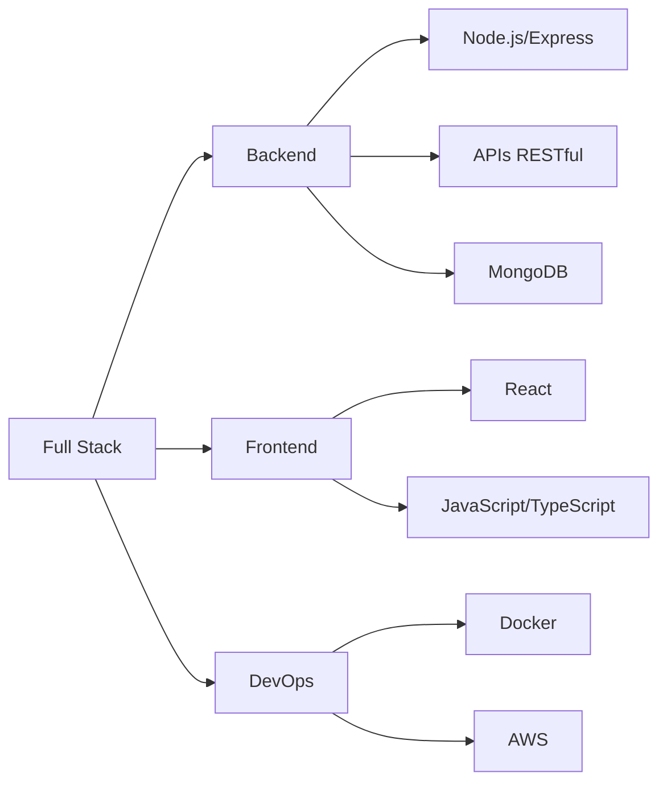

<div align="center">
  
</div>

<div align="center">
  
  [](https://www.linkedin.com/in/gabrieldevx/)
  [](https://www.instagram.com/feliquitox/)
  [](#)
  
</div>

---

## 🚀 Sobre Mim

```typescript
const gabriel = {
    nome: "Gabriel Felix",
    localização: "Brasil 🇧🇷",
    role: "Desenvolvedor Full Stack",
    código: ["JavaScript", "TypeScript", "Python", "HTML", "CSS"],
    ferramentas: ["Node.js", "React", "Docker", "AWS", "MongoDB"],
    foco_atual: "Construindo soluções escaláveis e inovadoras",
    hobbies: ["Aprender novas tecnologias", "Contribuir em open source", "Compartilhar conhecimento"],
    objetivo_2025: "Dominar arquiteturas de microsserviços e cloud native"
};
```

<div align="center">

### 💡 *"Código limpo não é escrito seguindo regras. É escrito com o coração."* 

</div>

---

## 🛠️ Arsenal Tecnológico

<div align="center">

### 🎯 Linguagens & Frameworks


### ☁️ Cloud & DevOps


### 🗄️ Databases & Tools


</div>

---

## 📊 Estatísticas do GitHub

<div align="center">
  
  
</div>

<div align="center">
  
</div>

<div align="center">
  
</div>

---

## 🏆 GitHub Trophies

<div align="center">
  
</div>

---

## 🐍 Contribuições

<div align="center">
  
</div>

---

## 💼 Experiência em Destaque

<div align="center">



</div>

---

## 📈 Atividade Recente

<!--START_SECTION:activity-->
<!--END_SECTION:activity-->

---

## 🎯 Projetos em Destaque

<div align="center">

[](https://github.com/gfeelixsantos/SEU_PROJETO_1)
[](https://github.com/gfeelixsantos/SEU_PROJETO_2)

</div>

---

## 📚 Atualmente Estudando

<div align="center">


</div>

---

## 💬 Vamos Conversar?

<div align="center">

Estou sempre aberto a novas conexões, colaborações e oportunidades! 
  
**Sinta-se à vontade para me contatar:**

[](mailto:seu-email@exemplo.com)
[](https://www.linkedin.com/in/gabrieldevx/)
[](https://www.instagram.com/feliquitox/)
[](#)

</div>

---

<div align="center">
  
### 🌟 Se você gostou do meu perfil, deixe uma ⭐ nos meus repositórios!


</div>
